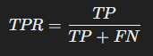
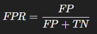
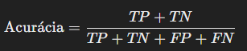
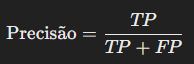
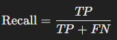
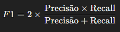
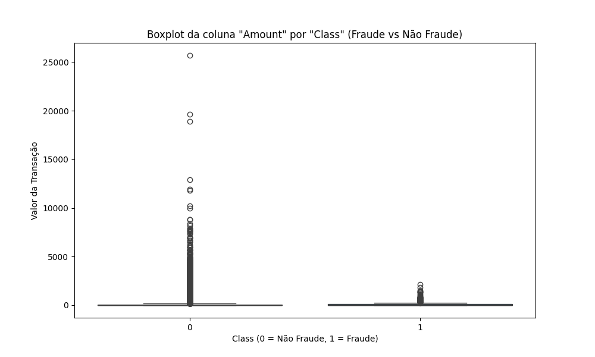
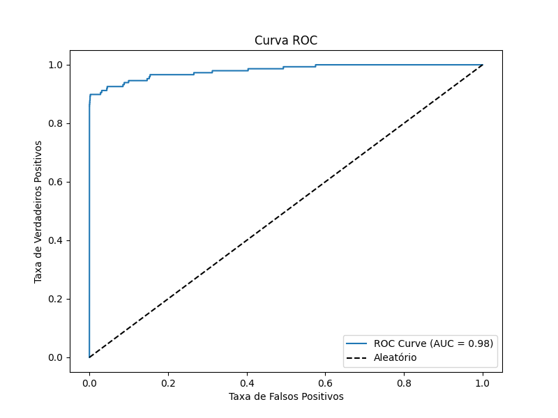

## Descrição do Projeto
Este projeto é um modelo de classificação binária desenvolvido para detectar fraudes financeiras em transações. Utiliza algoritmos de aprendizado de máquina e visualizações para avaliar o desempenho do modelo e compreender os padrões dos dados.

### Estrutura do Repositório
- `modelo.py`: Código principal contendo o modelo de classificação.
- `Gráficos`: Apresenta os gráficos gerados para fazer análise dos dados.
- `csv`: Pasta com o arquivo que deve ser utilizado no código 

## Dataset
O arquivo csv se encontra de forma compactada na pasta chamada `csv`.

## Requisitos
- Python 3.x
- Bibliotecas: `numpy`, `pandas`, `sklearn`, `matplotlib`

## Execução do Código
1. Certifique-se de que todas as dependências estão instaladas.
2. Extraia o dataset e forneça o caminho correto no código.
3. Execute o script `modelo.py`.

## Conceitos Matemáticos
### 1. Quartis
São os valores que dividem um conjunto de dados ordenados em blocos com 4 partes iguais, cada uma com 25% dos dados.

- Q1 (Primeiro Quartil): 25% dos valores estão abaixo deste ponto.
- Q2 (Mediana): 50% dos valores estão abaixo deste ponto. Representa o valor central.
- Q3 (Terceiro Quartil): 75% dos valores estão abaixo deste ponto.
- Pontos fora do intervalo de [Q1−1.5×IQR,Q3+1.5×IQR] É usado para identificar outliers, qualquer valor acima dele ou abaixo é um outlier.

### 2. Curva ROC e AUC 
A Curva ROC (Receiver Operating Characteristic) avalia o desempenho de um classificador binário, considerando:

#### <b> TPR (Taxa de Verdadeiros Positivos): </b>

Onde:
- TP: Verdadeiros positivos
- FN: Falsos Negativos

#### <b>FPR (Taxa de Falsos Positivos):</b>

Onde:

- FP: Falsos positivos.
- TN: Verdadeiros negativos.

Uma AUC = 1 tem uma classificação como perfeita e uma AUC = 0,5 indica que o modelo não tem capacidade preditiva.

### 3. Matriz de Confusão

- Linhas: Classe Verdadeira
- Colunas: Classe Prevista

#### Componentes:

- <b>Verdadeiros Positivos (TP):</b> Fraudes corretamente identificadas como fraudes.
- <b>Verdadeiros Negativos (TN):</b> Não fraudes corretamente identificadas como não fraudes.
- <b>Falsos Positivos (FP):</b> Não fraudes incorretamente identificadas como fraudes.
- <b>Falsos Negativos (FN):</b> Fraudes incorretamente identificadas como não fraudes.

Métricas derivadas:

1. Acurácia (Taxa de Acerto na Identificação):

2. Precisão (Fraudes identificadas corretamente entre todas as previstas como fraudes):

3. Recall (Fraudes identificadas corretamente entre todas as fraudes verdadeiras):

4. F1-Score (Média harmônica entre precisão e recall):

## Visualizações

### 1. Boxplot: Fraude vs Não Fraude

Boxplot que compara os valores das transações entre as classes. Transações fraudulentas tendem a ter valores distintos dos não fraudulentos, principalmente valores mais baixos para evitar suspeitas.

### 1. Curva ROC

 O AUC obtido foi **0.98**, indicando excelente desempenho.

### 3. Matriz de Confusão

O modelo acertou 85286 TN e 121 TP, com poucos erros (27 FN e 9 FP).

